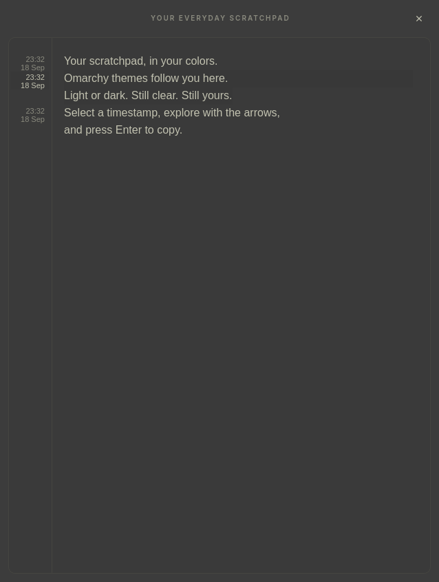

# Perfect Note

Your everyday scratchpad. Open it, paste something worth keeping, hide it.



A small native GTK 4 app made for Omarchy and Arch Linux. Each paste gets a compact date and time in the left margin. Move between clips, select individual words, and copy or delete without leaving the keyboard. Your note saves locally as you type.

The tall, floating window has a softly transparent background, with fully opaque text and selections for readability. No account, cloud service, or automatic clipboard monitoring.

## Install on Arch / Omarchy

Install the system dependencies, clone the repository, and run it:

```sh
sudo pacman -S --needed git python python-gobject gtk4 ttf-liberation
mkdir -p ~/Work
git clone https://github.com/sagosand/perfect_note.git ~/Work/perfect_note
/usr/bin/python3 ~/Work/perfect_note/perfect_note.py
```

Run the same command again to show or hide the existing instance. Closing the window hides it; it starts on demand, so no login service is required. Requires Python 3.11 or newer. Use the system Python rather than an isolated virtual environment so it can find PyGObject.

### Super+N and the floating window

For Omarchy with Lua-based Hyprland configuration, copy the example:

```sh
cp ~/Work/perfect_note/omarchy.lua ~/.config/hypr/perfect-note.lua
```

Add this line once at the end of `~/.config/hypr/hyprland.lua`:

```lua
require("hypr.perfect-note")
```

The example uses `~/Work/perfect_note`. Update its launch command if you cloned elsewhere. Check that Super+N is free before adding the binding; choose another key if it is already assigned. If you already have a Perfect Note configuration, update that file instead of adding a second binding.

```sh
hyprctl reload
hyprctl configerrors
```

The configuration uses Omarchy's `o.bind` and `o.window` helpers and the current [Hyprland Lua window rules](https://wiki.hypr.land/Configuring/Basics/Window-Rules/). Older Hyprland configurations and other desktops need their own shortcut and window-rule setup. Running the app itself only requires GTK 4, PyGObject, and a graphical desktop session with D-Bus.

## Use

| Action | Control |
| --- | --- |
| Open / hide | Super+N after configuring the shortcut |
| Paste | Ctrl+V, Shift+Insert, context menu, or middle-click for primary selection |
| Select a paste | Click its timestamp, or press Tab |
| Cycle pastes | Tab / Shift+Tab; Up / Down when a whole paste is selected |
| Select words | Right / Left to enter a paste; arrows to move within it |
| Copy a marked paste or word | Enter or Ctrl+C |
| Remove selected text | Delete / Backspace; Ctrl+X to cut |
| Undo / redo | Ctrl+Z / Ctrl+Shift+Z |
| Back out / hide | Escape, one selection level at a time |
| Insert a newline | Enter during normal editing |

Each paste gets one compact local time and date in the left gutter, beside its first line. Pasting starts a new line when needed. Timestamps stay outside the note text, so copying and the plain-text export contain only your words. Typing does not create timestamps. Replacing text inside a segment preserves its date. Inserting a new paste inside another splits the original into separately selectable pieces that retain the original date. Existing notes are imported without guessed dates.

Click a timestamp to mark its entire paste. When the whole paste is marked, Up/Down cycles through pastes. Right enters at the first word; Left enters at the last word. Inside a paste, Left/Right selects individual words or punctuation, and Up/Down selects the closest word on the line above/below. Vertical movement follows wrapped lines, skips empty lines, and stays inside the current paste. Left from the first word returns to the whole paste. Tab cycles to the next paste; Shift+Tab cycles to the previous one, wrapping at either end. Tab also starts segment navigation from normal editing. Enter copies the selection. Ctrl+C and Ctrl+X work normally; Delete or Backspace removes the selected paste or word. Deleting selects the next available paste or word. Ctrl+Z restores deleted text and timestamps.

Escape backs out one level: word to whole paste, whole paste to normal editing, then hides the window. Clicking in the text, typing, or using modified arrows returns to normal editing. Marking uses ordinary text selection, so typing replaces the selection and Shift+arrows can adjust it.

The centered floating window is 638 x 845 pixels. Each opening moves to the end and adds a newline only if the last line is not already empty. Repeated opening and hiding does not accumulate blank lines, including lines containing only indentation. Timestamps are stacked when edits place multiple segments on the same text line. Paste timestamps move with edits and are restored by undo and redo within the current session.

Edits save after 150 ms of inactivity and immediately when hiding. The complete note and paste timestamps live together in `~/.local/share/perfect-note/note.json` (or `$XDG_DATA_HOME/perfect-note/note.json`). `note.txt` is an automatically refreshed plain-text export; edit the note in the app, since subsequent launches load `note.json`. Atomic replacement avoids partially written files. Previous-session backups are kept as `note.json.bak` and `note.txt.bak`.

Saving is silent. If saving fails, the window stays open with an error; Ctrl+S retries. A normal termination request also waits for saving to succeed. Invalid saved data is left untouched and opened read-only; backup-write failures do not prevent reading a valid note. This is a text scratchpad, with no clipboard monitoring or cloud service.

## Appearance

Perfect Note follows your active Omarchy palette automatically, including light themes. Background, text, timestamps, borders, cursor, and selections update within about two seconds of a theme change, even while the window is hidden. No hook or restart is needed. Selection text and small labels get a contrast fallback when needed.

It reads `~/.local/state/omarchy/current/theme/colors.toml`, with the older `~/.config/omarchy/current/theme/colors.toml` location as a fallback, respecting `XDG_STATE_HOME` and `XDG_CONFIG_HOME`. If no usable theme is available at startup, the original dark palette is used. A missing or invalid theme during a switch keeps the last working palette.

The window is 638 x 845 pixels. Background transparency is defined in `style.css`: the window uses 88% opacity and the paper adds a light tint. Text, timestamps, and selection highlights remain opaque. This works without compositor blur. For a solid background, change the window alpha from `0.88` to `1.0`.

To see CSS changes, stop the resident process and run the app again. On Arch, `pkill -TERM -f '[p]erfect_note.py'` requests a graceful save and exit; if saving fails, the app remains open and shows the error. Merely closing the window or rerunning the command toggles visibility and does not reload styles.

## Development

Run `/usr/bin/python3 check.py` inside a desktop session. The checks use temporary notes and clipboard stubs, including a briefly displayed sample window. They cover persistence, timestamp tracking, keyboard navigation, Unicode, clipboard ordering, and randomized edit/undo/redo operations. See [AUDIT.md](AUDIT.md) for the audit findings and verification limits.

## License and credits

[MIT](LICENSE). Created by sagosand, with coding, debugging, and testing assistance from OpenAI Codex.
